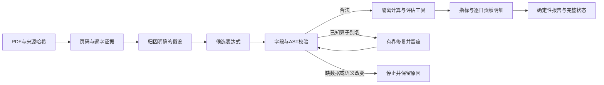

# Paper-to-Alpha Research Agent

## Full-stack 研究工作台（AI 接口预留）

本地单用户工作台：**论文与数据来源 → 数据/规则验证及显式登记 → 有出处的候选 → 版本化后台实验 → 实际结果 → 准确文字与数值审核 → 冻结报告、问题和回归样本 → 修订复测**。前端 React/TypeScript，后端 FastAPI，SQLite WAL 保存业务状态和队列，独立 Python worker 复用下述计算引擎。没有模型调用、API key 或自动审核。

当前源码版本为 v0.22.0 / schema17，包含准确审核材料、可扩展研究评测样本与公开 CI 交付工具。已有工作区升级须先完成冻结源码验收、独立安装和备份，具体运行与部署结论以对应验收记录为准。当前范围分别为：

| 路径 | 输入和可检查输出 | 边界 |
|---|---|---|
| 日度 Alpha101 因子 | 原论文公式、合成 OHLCV、表达式校验、Rank IC/毛收益、逐日明细与独立参考 | 软件验证，不证明市场表现 |
| 月度 MOM / MOM-ID | 受控月度 fixture、日期与缺失规则、组合/同样本基线及数值参考 | fixture；费用、换手与净值为目标权重代理 |
| 行业 MOM-only 修改案例 | Kenneth French current-vintage 49 行业预计算组合月收益、真实后台结果、同样本多头基线及逐月毛收益 | 行业组合，非个股论文复现；不含交易费用、成交可行性或 point-in-time 历史；保留区间未评价 |
| 作者公开数据准入 | 扰动 MAT 原行、字段覆盖和来源/协议绑定诊断 | 条件不足时停止，未生成作者组合回测 |

真实判断和自动化记录分开；没有本人标签、实际流程记录或模型运行时，质量成绩与节省时间保持未测量。当前交付整理见 [CI 与公开源码边界](docs/v022_ci_delivery.md)，研究验收任务见 [v0.22 计划](docs/v022_research_acceptance_plan.md)。

准确结论审核页面可打开绑定本版本的原 PDF、方法、配置与作者代码阅读副本；现有五维判断继续由本人填写。操作见 [先看依据，再判断](docs/v022_human_review.md)。材料包经只读导出后，可构建日度 Alpha101 或行业 MOM 评测样本；报告分别核对来源字节、实际指标和人工参考状态，无模型运行时保留 `model_not_run`。操作见 [研究样本评测](docs/v022_research_evaluation.md)。

首次安装与启动（macOS/Linux，本次验证 Python 3.14、Node 24）：

```bash
# 在项目根目录执行；Python 3.14 / Node 24
python3 -m venv .venv
.venv/bin/python -m pip install -r requirements-web-lock.txt
.venv/bin/python -m pip install --no-deps -e .
.venv/bin/python scripts/fetch_demo_paper.py --out artifacts/my-paper-bootstrap
npm --prefix frontend ci
npm --prefix frontend run build
.venv/bin/python -m paper_alpha.server.launcher
```

打开 **http://127.0.0.1:8765**，点击「导入示例研究」。API 文档位于 `/docs`。已有环境可直接运行最后一条命令。Ctrl+C 停止 API 和 worker；数据留在 `var/workbench/`。端口冲突时加 `--port 8766`。`--home /absolute/path` 可选择独立工作空间。

公开 checkout 不包含原 PDF、完整提取文本或页图；bootstrap 从 [arXiv v3 原出处](https://arxiv.org/pdf/1601.00991v3) 取得 PDF，核验固定摘要并用锁定 pypdf 重建同字节 `paper.json`。正确已有文件只复验，错误已有文件拒绝覆盖；每次使用新 receipt 目录。下载不是再分发授权。第三方行业/作者原材料仍需操作者单独登记；不会从公开源码中获得。

日常操作：**确认候选 → 运行 → 审核 → 报告**。人工流程对照是可选评测，不是日常使用的前置条件。v0.10 将记录 JSON 与技术身份移到高级入口和后台关联，操作见 [简化后的使用说明](docs/v010_workflow.md)。

v0.19 补齐三个工程连接处：引擎等价的完整观察行继续保护保留日期；「研究执行」可有界推进原月度夹具队列，并将作者准入诊断稳定停止；「语义评测」支持七项冻结论文材料的来源查看、无默认判断的五维标注、原键恢复、追加历史和覆盖汇总。没有人工数据时仍待确认，自动化标签不作为人工真值，材料标注不批准实验或结论。AI 与完整 UI 设计保持后置。见 [本轮操作说明](docs/v019_workflow.md) 和 [完整剩余计划与分工](docs/v0.19任务清单与Agent分工.md)。完整工程例子：`.venv/bin/python scripts/demo_v019.py --out artifacts/my-v019-example`。

v0.20 接通准确文字版本的独立五维审核、版本化固定材料参考集及声明一致性核对、Momentum 论文/协议/作者 scan 的准确来源绑定。人工判断与自动化隔离；无人工参考或模型调用时不生成质量成绩；真实作者源仍按数据不足／方法未决停止。基础入口在原「研究任务」「语义评测」「研究准入」页面内，用户不需手填来源 hash。见 [操作说明](docs/v020_workflow.md) 和 [详细计划与分工](docs/v0.20任务清单与Agent分工.md)。完整工程例子：`.venv/bin/python scripts/demo_v020.py --out artifacts/my-v020-example`。

发布收尾见 [验收与升级计划](docs/v020_release_closeout.md)。升级后先按 [研究操作清单](docs/v020_next_research_steps.md) 完成一项材料判断、一条准确结论审核和一个小型参考集；六阶段人工流程对照可单独进行，真实行情研究按数据与方法准入条件推进。

当前 Alpha101 人工审核准备工具可从已有冻结 Case 导出原 PDF、三条自动化草稿、服务计算的指标和准确审核目标，支持原请求恢复、离线核验及只读联机核对。它不重跑实验、不填写人工判断、不更新运行应用。操作见 [第一轮人工审核快捷指引](docs/v020_human_review_quickstart.md)，实施边界见 [本轮准备计划](docs/v020_human_preparation_plan.md)，实际验收见 [交付记录](docs/v020_human_preparation_delivery.md)；真实数据仍缺的条件见 [Momentum 阻断复核](docs/v020_real_data_blockers.md)。

第一条 Alpha101 草稿的辅助审核已完成论文页面、冻结指标和原实现的只读核对。按 [五维审核阅读指引](docs/v020_assisted_review_guide.md) 在现有准确文字表单填写本人判断；核对依据与人工结论分开，当前没有人工语义成绩。见 [分工与完成状态](docs/v020_assisted_review_plan.md)。

用户选择的行业组合 MOM-only 修改案例已有独立本地 CLI：官方 49 行业月度收益 → 固定十一月信号 → 形成权重 → 同样本多头基线 → 独立数值参考 → 冻结报告。用 `.venv/bin/python -B scripts/demo_mom_only.py --out artifacts/my-mom-only-demo` 运行本机已保存的固定来源；方法、来源和操作见 [说明](docs/v020_mom_only_workflow.md)，原 CLI 结果见 [交付](docs/v020_mom_only_delivery.md)。它只评价 2010–2011 开发区间，保留 2012–2013；原个股研究仍有独立的数据阻断。

v0.21 将这条固定行业路径接入原“研究执行”页面：本地注册来源 → 后台排队计算 → 查看实际毛收益与逐月输出 → 下载准确报告 → 关联研究案例 → 准确结论与五维审核。新工作区需要先登记自己的固定来源，源码包不包含本轮第三方原材料。见 [详细计划及 Agent 分工](docs/v021_mom_workbench_plan.md)、[操作和启动说明](docs/v021_mom_workbench_workflow.md)。隔离真实闭环：`.venv/bin/python -B scripts/demo_v021_mom_workbench.py --artifact artifacts/mom-only-development-01 --out artifacts/my-v021-example`。页面的计算核验不会自动生成研究认可或人工质量成绩；这是行业修改案例的回顾性毛收益方法演示。

v0.18 新增「研究执行」：在固定论文、数据和评估区间下，校验人工候选草稿，复用已有修订、队列和计算引擎推进到实际结果。全流程预算与步骤账本可恢复；相同市场 CSV 的保留测试区间跨修订、复制和重新登记保持保护。研究任务投影已有五维审核，结论草稿用精确结果引用生成可信数值，文字语义仍待人工确认。首版受控执行适配日度本地因子路径，Momentum 作者数据维持现有阻断；AI 与 UI 设计继续后置。见 [操作说明](docs/v018_workflow.md)、[任务与分工](docs/v0.18任务清单与Agent分工.md)、[评测边界](docs/v018_evaluation.md)。

v0.17 新增「研究任务」：将已有因子结果、受控月度结果或作者准入筛查关联为有精确版本的研究上下文，集中展示依据、项目约定、实际输出、阻塞原因和允许下一步。受限工具会话仅读取这些产物并保存自动化草稿，保留累计预算、调用记录及安全重放；AI 提供商仍未接入。操作见 [研究任务与工具流程](docs/v017_workflow.md)，范围与分工见 [v0.17 任务计划](docs/v0.17任务清单与Agent分工.md)，固定评测见 [规则评测边界](docs/v017_evaluation.md)。这条诊断与提案链不等于作者源组合回测或人工语义评测已完成。

v0.16 新增「研究准入」：预先声明任务和开发区间，扫描作者数据全部原行，分别统计 MOM、MOM+DGW、MOM+MV 与三字段交集；关联论文依据、计划、数据源、筛查输出及审核修订。未达到门槛会保存可解释阻断，数量达标也不自动开放组合执行。见 [操作说明](docs/v016_workflow.md)、[详细优化计划与分工](docs/v0.16任务清单与Agent分工.md) 和 [接口契约](docs/v016_author_study_contract.md)。

v0.15 新增独立「作者数据」入口：针对已选 momentum 论文的公开扰动 MAT 包，完成固定源校验、原行月度提取、MOM/DGW/标签对齐诊断、独立数值参考、不可变导入记录及报告。实际公开包缺失严重，本轮不生成论文组合收益；原 MAT 核验由本地 CLI 完成。见 [操作说明](docs/v015_workflow.md)、[实际文件审计](docs/research/momentum_author_data_audit.md)、[任务与分工](docs/v0.15任务清单与Agent分工.md)。

v0.14 将保存的研究规则接入独立「月度实验」：固定输入、后台任务、同样本 MOM 基线与 MOM-ID 分组对照、逐月权重与完整标签、独立数值参考、结果绑定审核和冻结报告。成本、换手、净值明确为目标权重代理；缺月不拼接。该月度组合路径的数据仍是受控夹具；v0.15 作者源诊断另设入口。完整示例：`.venv/bin/python scripts/demo_v014.py --out artifacts/my-monthly-example`。见 [操作说明](docs/v014_workflow.md)、[任务与分工](docs/v0.14任务清单与Agent分工.md)、[数据来源调查](docs/v014_data_source_assessment.md)。

v0.13 新增独立「研究规则」入口，明确区分论文未决项与项目约定，支持按自然月调整 MOM/ID 窗口、日期预览、缺行/空值/历史不足诊断和不可变规则版本。默认完整覆盖、不填缺失；高级部分观测规则明确保留其研究偏差。预览使用受控夹具。见 [操作说明与可复算快照](docs/v013_workflow.md)、[任务与分工](docs/v0.13任务清单与Agent分工.md)。

v0.11 在审核候选时按需显示每日毛收益、有效日毛收益算术累计、Rank IC 和资产覆盖图，并保留缺失原因及逐日表格。图表绑定当前选定实验的冻结结果；算术累计不是复利净值，合成数据不能说明投资表现。完整 UI 设计仍留待后续。见 [本轮任务与边界](docs/v0.11任务清单与Agent分工.md)、[图表使用说明](docs/v011_review_charts.md)和[审核并发测量](docs/v011_review_concurrency.md)。

v0.12 修复相关算子的自相关舍入和极端缩放问题，并为修订、问题反馈及回归检查补齐刷新后的原请求恢复。后台准备、计算、核验、发布阶段持续心跳，文件操作移出领取任务的写事务；终态页面使用轻量状态探测，点击「重新核验当前实验」时完整核验并刷新图表。schema 8 增加工作流请求收据，历史结果不重算；旧算子结果与新参考不兼容时显示不可比较。见 [工程优化任务与分工](docs/v0.12任务清单与Agent分工.md)、[升级与接口边界](docs/v012_integration.md)、[数值契约及计算成本](docs/v012_numerical.md)。

- [逐步操作、开发与恢复说明](docs/workbench_guide.md)
- [系统设计和当前边界](docs/workbench_design.md)
- [HTTP 与数据契约](docs/fullstack_contract.md)
- [离线备份、校验与恢复](docs/backup_restore.md)
- [v0.4 数据导入、研究复测及评测指南](docs/v04_workflow.md)
- [v0.5 任务与分工](docs/v0.5任务清单与Agent分工.md)
- [API 响应契约与生成检查](docs/v05_api_contract.md)
- [本地源码包与独立目录安装](docs/portable_release.md)
- [只读诊断与容量](docs/diagnostics.md)
- [用户选择的 Alpha101 研究案例与人工评测协议](evaluation_suites/v05/README.md)
- [v0.6 任务与分工](docs/v0.6任务清单与Agent分工.md)
- [结构化研究审核与主动工作时间](docs/v06_research_review.md)
- [数据错误定位与诊断边界](docs/v06_data_diagnostics.md)
- [独立数值参考扩展及开发集](docs/v06_numerical_coverage.md)
- [v0.7 评估、任务与分工](docs/v0.7任务清单与Agent分工.md)
- [审核与批准的幂等契约](docs/v07_idempotency.md)
- [审核草稿和待确认请求恢复](docs/v07_review_recovery.md)
- [工作区身份与实验监控](docs/v07_workspace_state.md)
- [待人工执行的流程对照协议](docs/v07_human_evaluation.md)
- [v0.8 评估、任务与分工](docs/v0.8任务清单与Agent分工.md)
- [安全提交、实验对比与冻结总结操作](docs/v08_workflow.md)
- [v0.9 完整优化计划与分工](docs/v0.9任务清单与Agent分工.md)
- [六阶段观测回流与可复现示例](docs/v09_workflow.md)
- [真实数据和保留研究材料接入前检查](docs/v09_research_readiness.md)
- [最终测试流程实施规范（未开放执行）](docs/v09_final_test_protocol.md)
- [v0.10 操作简化任务与分工](docs/v0.10任务清单与Agent分工.md)
- [日常研究和可选人工对照](docs/v010_workflow.md)

工作台是单机、单用户工程版本；真实行业组合来源已接入独立 MOM-only 路径，日度因子入口仍仅接受合成数据。BRAIN、模型、RAG 和公网多用户认证未接入。日度独立参考覆盖限定的 Alpha006/101/012、明确归因为修改的 Alpha033，以及 Alpha101 的五日均值、五日样本标准差和延迟一日三个本地修改式；未覆盖的表达式保留缺口。各域分别记录数据语义、结果和限制，数值核验不能代替论文语义或经济有效性的人工判断。390px 长 UUID 目录溢出已知，完整 UI 设计及响应性修复后置。

v0.5 增加基础研究表单、明确恢复的本机草稿、修订差异和审核关联选择器。主要 HTTP 响应由后端模型校验，前端类型及运行时检查从 OpenAPI 生成。普通研究操作不需要手填任务 JSON 或内部 ID，高级 JSON 入口继续保留。

v0.6 增加绑定具体尝试和候选摘要的五维研究审核、可选的显式主动工作区间，以及有行列/日期/资产定位的数据错误。旧审核保持未分项评定；自动化记录不成为人工语义通过。同一声明审核人的重叠时间区间在汇总中合并，未记录显示为未测量。新开发集包含三个 Alpha101 修改式和明确不支持的窗口变体，保留覆盖缺口，不把同源修改当作独立研究发现。

v0.7 为审核和批准用例增加事务化请求收据。客户端在提交前保存原请求及标识，丢失响应后可以确认原操作；普通审核也发送明确的尝试和结果前置条件。本机审核草稿绑定工作区和冻结结果，显式恢复；未结束的计时不会续算。工作区身份与实验监控提取为独立 hooks，暂时离线保留已确认身份。人工对照协议仍待本人执行，没有填入语义结论或节省时间。

v0.8 将安全重试扩展到研究创建、实验提交和研究总结。新增历史实验条件与指标来源对比；配置未知或不兼容时保留结果但不展示差值。研究总结按明确选择的实验冻结证据、修订、尝试、失败与相关反馈，提供同一快照的 JSON/Markdown 下载，后续审核不会改写旧报告。schema 6 支持旧记录迁移、请求收据和报告备份恢复。前端保持基础设计。

v0.9 新增「流程观测」：下载空白模板、导入实际填写的六阶段记录、预检协议/绑定/时间、确认来源后不可变保存、刷新安全重试、分路径汇总与 JSON 导出。schema 7 保留既有数据。自动化和练习记录不进入人工对照，缺失阶段不填零；仅相同声明条件下的完整两路径个案生成耗时差。人工真实观测仍待本人执行。另提供真实数据与独立材料的离线准入检查，完整声明不等于行情已适配、授权已认证或研究已通过；最终 test 仍隔离。

统一验收：`.venv/bin/python scripts/verify_release.py --out artifacts/my-release-check --browser-channel chrome`。输出契约检查、全套测试、固定基线、HTTP 回流与恢复、故障注入、冻结总结、来源隔离、独立安装和浏览器验证及源码清单。每次使用新目录，正式结论以该目录的 `acceptance.json` 为准。离线准备检查可用 `python3 scripts/check_ci_readiness.py --out artifacts/my-ci-readiness`，不能代替实际远端 Linux 运行。目标 [GitHub 仓库](https://github.com/Owenqi666/quant-ai-agent) 已提供；本轮初始观察 Actions 无运行，后续发布及准确 CI 提交/结果由交付记录确认。公开 CI 从原出处取得固定示例论文，附件仅上传验收摘要与日志，详见 [交付边界](docs/v022_ci_delivery.md)。

## 原有 CLI 计算引擎

面向 SWE 工程实践的、可追溯的论文因子研究原型。当前已实现一条离线最小流程：**本地 PDF → 有页码的公式证据 → 结构化假设与候选 → 数据和表达式校验 → 有界修复 → 本地验证区间评估 → 可检查报告**。

当前 proposal provider 是有明确支持范围的公式模板，决策器是确定性状态机，尚未接入 LLM。示例来自已有材料《101 Formulaic Alphas》，使用 400 个合成交易日期 × 12 个合成资产；它验证软件正确性，不证明 Alpha 有效性。用户于 2026-10-01 确认使用过这篇论文并选择它作为研究材料，确认记录在 `evaluation_suites/v05/material_confirmation.json`。这不等于已人工认可现有经济机制与全部假设；旧示例和历史实验保留当时的信息与归因。

## 启动

在 macOS / Linux、Python 3.11+ 上运行；本次实际验证环境是 CPython 3.14.4。状态锁使用 POSIX `fcntl`，Windows 原生运行未支持。无需 API key、数据库或网络行情。首次安装需要可用的包源，此后示例全程离线。

```bash
# 在项目根目录执行；先完成上方原出处论文 bootstrap
python3 -m venv .venv
.venv/bin/python -m pip install -r requirements-lock.txt
.venv/bin/python -m pip install --no-deps -e .

.venv/bin/python -m paper_alpha run examples/alpha101/task.json --out runs/my-first-run
.venv/bin/python -m paper_alpha verify runs/my-first-run
.venv/bin/python -m unittest discover -s tests -v
```

已有 `.venv` 可直接执行后三条。每次新实验使用新的输出目录；已有任务用 `--resume`：

```bash
.venv/bin/python -m paper_alpha run examples/alpha101/task.json --out runs/my-first-run --resume
```

恢复要求输入字节、配置、代码和运行环境一致。已完成任务不会重复计算；中断的尝试保留并消耗预算。修改了任何代码或输入时，使用新目录启动新实验。最终 test 区间在 v1 中没有解锁入口。

## 完整示例

输入：[task.json](examples/alpha101/task.json)。随交付保存的实际运行见 [研究报告](artifacts/demo/report.md)、[基线报告](artifacts/benchmark/report.md)、[测试验收记录](artifacts/acceptance.json)。若重跑基准，使用新目录：

```bash
.venv/bin/python -m paper_alpha benchmark --task examples/alpha101/task.json --out runs/my-benchmark
```

当前基准另含 `normalized_fixed`：执行前使用与有界修复相同的别名映射，再固定执行。新基准保存七次运行，分别报告三个表达式表示与两个预先声明的公式含义，避免把同义表达式算成新 Alpha。完整结果一致性检查包含规范化固定流程与有界修复的比较；不预设后者更优。

示例生成三条候选，所有引用必须与重新提取的 PDF 原文一致：

| 候选 | 出处 | 本地行为 |
|---|---|---|
| Alpha #6 | PDF 第 8 页 | 原式的 `correlation` 被校验器拒绝；状态机记录错误，只将算子别名改成 `ts_corr`，重新校验、计算和评估 |
| Alpha #101 | PDF 第 15 页 | 直接计算和评估 |
| Alpha #5 | PDF 第 8 页 | 所需 `vwap` 不存在，记录 blocked；不会偷偷用 `close` 替代 |

公式的归因是 `paper_original`；经济机制与适用条件仍需要人工审阅。示例中的机制解释标为 `model_conjecture`，不视作论文证明。修改窗口、方向、字段或组合方式，必须声明 `user_modification` / `model_conjecture` 和 `changes`。声称原文公式却与引用 AST 不一致的候选会被拒绝。

## 从 PDF 生成可编辑任务

```bash
.venv/bin/python -m paper_alpha ingest examples/alpha101/paper.pdf \
  --id arxiv:1601.00991v3 --title '101 Formulaic Alphas' \
  --url https://arxiv.org/abs/1601.00991v3 --version v3 --out runs/extracted-paper.json

.venv/bin/python -m paper_alpha draft \
  --paper runs/extracted-paper.json --pdf examples/alpha101/paper.pdf \
  --data examples/alpha101/market.csv --metadata examples/alpha101/metadata.json \
  --evaluation examples/alpha101/evaluation.json --out runs/draft-task.json

.venv/bin/python -m paper_alpha run runs/draft-task.json --out runs/draft-experiment
```

`draft` 当前只识别 Alpha #6 / #101 / #5 的已审核公式模板，且必须在正文中找到编号和公式，不依赖标题。未知论文会明确报错；也可以参照 task.json 手工填写原文引文、假设、候选与配置，再交由执行器校验。扫描版无可提取文字的 PDF 需要 OCR/人工转录后另行核验；没有假装完成通用论文理解。

## 工程结构



- `contracts.py`：研究证据、假设、候选、预算的显式数据结构。
- `evidence.py` / `proposals.py`：PDF 校验与受限模板提案；引用命中不代表语义忠实度已经通过。
- `expressions.py`：AST 白名单解释器、字段与轴校验、算子语义版本；复用旧算子，修复滚动相关的数值稳定性和缺失传播。不执行候选 Python。
- `evaluation.py`：完整日历 × universe 数据契约、时间切分、延迟执行、Rank IC 与 gross=1 / net=0 组合明细。
- `workflow.py` / `worker.py`：预算、子进程超时、文件锁、持久状态、恢复及源码快照执行。
- `reporting.py` / `benchmark.py`：直接由工具结果生成报告，与固定无修复流程对照。
- `vendor/`：已有因子/算子快照及来源哈希。保留旧实现用于检查；Agent 仅开放通过适配器的算子，不直接暴露旧模块全部功能。

## 计算和评估约定

信号使用 t 日收盘后已知信息，按 `open[t+2] / open[t+1] - 1` 评估。训练区间提供 trailing 历史；没有训练模型或拟合超参数。仅使用 validation 迭代，signal / entry / exit 三个时点均需在该区间，最后两个信号日因标签跨界而剔除。表达式计算在 validation.end 截断，最终测试数据不进入因子计算。

每日平均秩减去截面均值，再按绝对值总和归一化，得到 gross=1、net=0 权重。报告 mean Rank IC、gross return 均值/加总、有效天数、purged 天数和覆盖率，保存逐资产权重、入场/出场价、收益标签及贡献，允许独立复算。无效/常量信号日被记录并跳过；IC 还跳过常量收益日，因此比较候选时必须同时检查覆盖率和样本数。

本节日度引擎没有费用、滑点、借券、成交约束、组合净值回测或统计显著性宣称，数据入口**仅接受 synthetic**。真实个股 OHLCV 仍需确定交易日历、复权、历史 universe 和可得时点；独立行业月度路径的 current-vintage 组合收益不放宽本节日度合同。

窗口最大 252，表达式最多 2,048 字符 / 256 AST 节点 / 32 层；负 shift、属性访问、任意 Python 调用被拒绝。非有限中间结果会传播为缺失并记录诊断，不能被 `rank` 或比较运算掩盖。单输入文件最多 64 MiB、单面板 2,000,000 格、验证明细 100,000 格。候选、尝试、工具调用及累计工具流程时间均有上限。进程被强制终止后的未记账工具时间，恢复时保守地连同停机时间计入预算。

## 实验记录和可复现性

每个运行目录包含：

```text
manifest.json       输入/代码 SHA-256、依赖与 Python 版本
inputs/             task、PDF、提取文字、市场数据、元数据的快照
source/             本次执行使用的源码快照
state.json          原子写入的权威状态，包含失败/中断的尝试
events.jsonl        按序号导出的事件；恢复时可从 state 重建
tools/              每次工具调用的请求、响应和日志
candidates/         每次成功计算的 factor.csv 和 result.json
report.md           工具结果的确定性投影
```

`verify` 检查输入/源码/工具制品哈希、结果与状态一致、报告数字与已存结果一致。哈希用于发现意外漂移，未实现签名或防止同时篡改整个目录。`--resume` 可以重建报告和事件视图，但结果制品校验失败会拒绝恢复。旧版运行应使用其源码快照和记录的环境检查；修改代码后新建实验，不覆盖旧记录。

## 已有材料与后续顺序

盘点见 [项目审核](docs/project_audit.md) 和 [旧因子引擎审核](docs/legacy_factor_audit.md)。复制前清单见 `docs/import_manifest.json`，两个原始目录均未修改。

接下来需要本人对准确 Alpha101 / 行业案例填写五维判断，按适用协议记录实际人工流程；无人工记录仍保持 pending。行业来源已接通，原个股研究数据与方法不足条件继续保留。远端目标已提供，公开代码与实际 CI 验收推进中；独立保留研究材料和最终区间评测仍未完成。AI/RAG 继续留白，待确定性链路和研究评测足够成熟后再决定接入；BRAIN 人工导出/导入、自动检索和跨论文组合仍是后续范围。

BRAIN 后续应单独记录字段映射、算子目录及版本、region/universe、delay、decay、neutralization、truncation、测试日期、原始仿真配置和平台返回结果，并关联共享 hypothesis/candidate ID。当前没有连接平台，没有证明 BRAIN 表达式合法性，也没有将本地结果视为平台等价结果。

SWE 写作依据与待确认的个人贡献见 [工程成果清单](docs/resume_evidence.md)。

> Public metadata projection: local source paths or personal runtime/profile details omitted; historical engineering facts retained. Original private document SHA256: 201421f91dd71e219706920b03c5b347b25911d481970a66dcbe53e4b49fc8f7.
