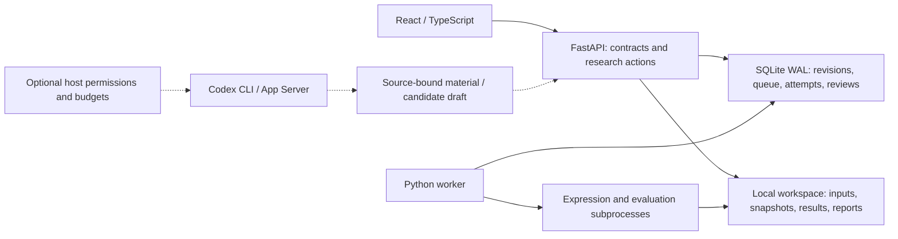

# Paper-to-Alpha Research Agent

A local research workbench that connects paper evidence, alpha hypotheses, executable factor expressions, and reproducible evaluation results.

The project grew from a personal research workflow used during WorldQuant competition participation: find a paper, extract an idea, implement a factor, evaluate it, and revise the research. It turns those steps into a full-stack application with explicit versions, execution records, and review decisions. WorldQuant is the research context, not an employment relationship or project affiliation.

**Version:** 0.27.2 | **Database:** schema 29 | **Delivery scope:** local macOS, single user, loopback access. The default workflow requires no model account.

## What the project demonstrates

- **Full-stack workflow:** React and TypeScript connect materials, evidence, candidates, experiments, and result review through typed FastAPI contracts.
- **Reliable background execution:** a SQLite queue and a separate Python worker retain attempts, events, failures, cancellation, and execution budgets after the browser closes.
- **Traceable research:** selected PDF pages, exact quotation spans, component-level source bindings, scientific attribution, saved revisions, input and code snapshots, result hashes, and frozen reports remain linked.
- **Controlled factor execution:** an AST-based expression whitelist checks fields, operators, windows, complexity, and exact panel alignment before calculation.
- **Recoverable state:** transactional idempotency receipts prevent duplicate writes after lost responses; offline backup and restore preserve research history.
- **Bounded automation:** an optional model adapter extracts source-bound material and proposes candidate drafts under host-controlled permissions and budgets. Deterministic checks repair supported representation errors and incomplete operator-definition citations through new versions.

## What changed in 0.27.2

See the [release notes](CHANGELOG.md) for the source changes.

The optional model workflow now connects selected PDF pages to structured material extraction, source-definition checks, formula engineering, candidate generation, and the existing worker. Component-level bindings distinguish a claim, calculation, signal direction, data meaning, and conditions. Missing economic explanations stay unresolved.

A finite deterministic check follows formula operator dependencies and can append missing definition citations from the already selected source spans. It saves a separate automation version and preserves the original draft, formula, data, and scientific unknowns. A successful mechanical check remains distinct from human semantic approval.

The matching local Runtime completed a bounded installation and model-to-worker acceptance workflow on one previously seen Alpha101 formula with synthetic data. This curated source publication excludes its private records and third-party paper. General paper understanding, human research quality, time savings, and profitability remain unmeasured. See [the model and source workflow](docs/model-workflow.md).

## Five-stage workflow

| Stage | User action | Saved output |
| --- | --- | --- |
| 1. Material | Register a text-extractable PDF, select pages, and declare a dataset | Source identity, checksum, bounded text spans, dataset metadata |
| 2. Hypotheses and evidence | Record material or inspect optional extracted drafts and definition checks | Exact quotations, component bindings, material versions, attribution, and unresolved questions |
| 3. Candidates | Define expressions or adopt optional drafts; inspect execution requirements | Validated definitions, explicit formula-engineering assumptions where applicable, and an immutable research revision |
| 4. Experiments | Explicitly submit a saved revision | Queued run, execution attempts, events, tool results, and diagnostics |
| 5. Result review | Inspect charts and evidence; accept, revise, or reject | Reviews, issues, approved regression cases, new revisions, and frozen reports |

Reports export the saved research and experiment facts. A revision or review does not overwrite an earlier result.

## Architecture


```mermaid
flowchart LR
    UI["React / TypeScript"] --> API["FastAPI: contracts and research actions"]
    API --> DB["SQLite WAL: revisions, queue, attempts, reviews"]
    API --> Files["Local workspace: inputs, snapshots, results, reports"]
    Worker["Python worker"] --> DB
    Worker --> Tools["Expression and evaluation subprocesses"]
    Tools --> Files
    Host["Optional host permissions and budgets"] -.-> Model["Codex CLI / App Server"]
    Model -.-> Draft["Source-bound material / candidate draft"]
    Draft -.-> API
```

The API serves the built frontend and JSON endpoints on the same origin. The browser polls saved status and events; the worker owns computation. Model proposals pass contract, exact-span, source-binding, attribution, expression, and field checks before adoption and normal worker execution. Material and research versions preserve the source and the assumptions used by each experiment.

| Layer | Technology |
| --- | --- |
| Interface | React 19, TypeScript, Vite, SVG charts, KaTeX/MathML |
| API and contracts | Python, FastAPI, Uvicorn, Pydantic, OpenAPI, generated TypeScript contracts |
| Calculation and evidence | pandas, NumPy, pypdf, restricted expression DSL |
| State and execution | SQLite WAL, transactions, filesystem locks, subprocesses, worker heartbeats |
| Optional model transport | Codex CLI Exec or App Server over stdio JSON-RPC; fixture provider |
| Verification | Python unittest, FastAPI TestClient/HTTPX, Vitest, Playwright |

See [architecture and execution design](docs/architecture.md) for object relationships and failure handling. Some factor and operator code was adapted from the author's earlier personal project; its provenance is retained in [third-party and reuse notices](THIRD_PARTY_NOTICES.md).

## Install from source

The locally accepted environment uses **Python 3.14 on macOS**. The package declares Python `>=3.11`, but that declaration is not acceptance evidence for every interpreter or OS. Vite requires `^20.19.0` or `>=22.12.0`. Node and npm are used for frontend development and build, not as the backend server.

```sh
git clone https://github.com/Owenqi666/quant-ai-agent.git
cd quant-ai-agent
python3.14 -m venv .venv
.venv/bin/python -m pip install -r requirements-web-lock.txt
.venv/bin/python -m pip install -e '.[web,test]'
cd frontend
npm ci
npm run build
cd ..
```

The locks pin the Python and frontend dependencies. The runtime has no CDN dependency after the frontend is built.

## Quick experience

An original tutorial document and synthetic OHLCV data provide a complete CLI example without a model call or a third-party paper download:

```sh
.venv/bin/python scripts/prepare_public_demo.py --output-dir .demo/inputs
.venv/bin/python -m paper_alpha run .demo/inputs/task.json --mode fixed --out .demo/run
.venv/bin/python -m paper_alpha verify .demo/run
```

Read `.demo/run/report.md` for computed results and diagnostics. The preparation script creates inputs; the ordinary worker tools calculate the metrics. Use fresh output directories for another run. The candidate is a toy definition, and the data are synthetic.

To open the full interface, start a separate local workspace:

```sh
.venv/bin/python -m paper_alpha.server.launcher --home ./var/demo --port 8765
```

Open [the local workbench](http://127.0.0.1:8765/) and [the API reference](http://127.0.0.1:8765/docs). The launcher starts the API and worker together. `Ctrl+C` stops both; submitted state remains in `var/demo`. Use the material and research creation forms for your own prepared inputs; the CLI demo does not automatically seed a browser research record.

For the built-in Alpha101 browser example, obtain the fixed original paper from [arXiv, version 3](https://arxiv.org/abs/1601.00991v3), subject to its terms, and prepare it locally before importing the example:

```sh
.venv/bin/python scripts/prepare_alpha101.py --pdf /path/to/1601.00991v3.pdf
```

The script verifies the pinned PDF before extracting source material for the existing templates. The paper PDF and extracted full text are not distributed here. Alpha101 examples use synthetic data; they do not reproduce the paper's trading results. See [example preparation](examples/README.md).

## Evaluation and automation boundaries

The main daily workflow performs **factor research evaluation**. Signals formed after session `t` close are evaluated against `open[t+2] / open[t+1] - 1`, with all three sessions inside the selected validation interval. Outputs include mean Rank IC, daily gross returns, coverage, and explicit valid/skipped/boundary counts. Cumulative gross return is an arithmetic sum, not compounded NAV.

Costs, slippage, borrow, fills, liquidity, and capacity are not modeled. These results are not a complete trading backtest, WorldQuant BRAIN simulation, or evidence of a profitable strategy. The public demo is synthetic. See [evaluation semantics](docs/evaluation.md).

Two deterministic checks serve different purposes. Expression correction handles declared equivalents such as `correlation -> ts_corr` and policy-approved integral window representations. Source-definition checking follows a finite set of known operator patterns and can append existing selected-span citations and bindings in a new automation version. Missing or inconsistent source definitions remain blocked; these checks cannot invent data, replace required fields, change economic mechanisms, or optimize financial results.

Formula-engineering mode can evaluate a source formula while preserving an unstated economic mechanism as null and unresolved. It requires an explicit execution policy, supported calculation and data definitions, and a disposition for each original unknown. An execution gap cannot be reclassified as a scientific unknown. This mode verifies computation under declared assumptions; it does not establish the hypothesis's scientific validity.

Model dispatch is **off by default**. The App Server transport supports optional `extract_material` and `generate_candidates`; host configuration, current qualification, and call budgets are required. `repair_candidate` and `decide_next_action` are not supported by this transport. The latest bounded local acceptance connects real material extraction and candidate generation to deterministic validation, the original worker, and a saved report. The deterministic citation repair is separately verified and is not general LLM self-repair. Exact citations and binding coverage do not prove semantic entailment, and automated versions do not imply human approval.

Automated retrieval/RAG/OCR, automatic BRAIN simulation, certified point-in-time real equity data, and multiuser production operation remain outside the delivered scope. Actual backend model identity, total underlying requests, and monetary cost are not established by the dispatch receipts.

Advanced monthly, author-material, and archived evaluation workflows require separately prepared source inputs. Private historical research material is excluded from this publication; those workflows are not preloaded demonstrations in a clean clone.

## Tests and recovery

This publication includes representative tests for expression safety and alignment, evaluation timing and missing-data behavior, exact source spans, operator-definition coverage, formula-engineering unknowns, formula presentation, mutation idempotency, and workspace backup/restore. It does not bundle historical validation outputs or configure remote CI. Bounded checks of this export are documented in [publication validation](docs/publication-validation.md).

The following tests do not require a third-party paper:

```sh
.venv/bin/python -m unittest discover -s tests -p 'test_expressions.py'
.venv/bin/python -m unittest discover -s tests -p 'test_evaluation.py'
.venv/bin/python -m unittest discover -s tests -p 'test_formula_presentation.py'
.venv/bin/python -m unittest discover -s tests -p 'test_paper_segments.py'
.venv/bin/python -m unittest discover -s tests -p 'test_formula_engineering_material.py'
.venv/bin/python -m unittest discover -s tests -p 'test_operator_definition_public.py'
```

After local Alpha101 preparation, run the paper-dependent integration and recovery tests:

```sh
.venv/bin/python -m unittest discover -s tests -p 'test_mutation_idempotency.py'
.venv/bin/python -m unittest discover -s tests -p 'test_backup.py'
.venv/bin/python -m unittest discover -s tests -p 'test_formula_engineering_readback.py'
```

Test results establish software behavior within their fixtures, not financial effectiveness or measured user productivity.

Stop all processes using a workspace before maintenance. Backups use a consistent SQLite snapshot and a checksummed file manifest; restore always targets a new directory. See [backup, restore, and upgrade](docs/recovery.md) for commands and recovery limits.

## Repository scope

This repository is a curated source publication of the maintained application, dependency locks, build and preparation tools, selected tests, and public examples. User databases, research records, accounts, credentials, permissions, enabled host configurations, logs, environments, historical experiments, validation artifacts, and local version backups are excluded.

See the [publication inventory and optional-source requirements](docs/publication-scope.md) for the exact classification. The separately accepted local Runtime and its frozen signoff remain local. Public source availability does not grant redistribution rights for external papers or datasets. No project-wide open-source license has been selected; dependency licenses remain with their respective owners. See [THIRD_PARTY_NOTICES.md](THIRD_PARTY_NOTICES.md).
