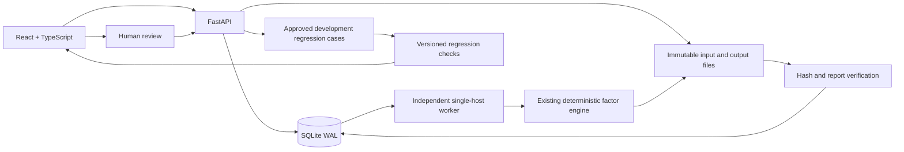

# Research workbench: system design

The first product increment completes a human-operated research loop. Model
proposal generation stays disabled. A future provider must return the same
versioned research contract and pass the same validators; it cannot write
metrics, approve its own reviews, or rewrite completed experiments.

v0.4 adds bounded synthetic dataset ingestion, snapshot event/catalog pagination,
explicit issue decisions bound to historical attempts, and reproducible feedback
aggregates. See `v04_workflow.md` and the additive HTTP contracts. PDF/numerical
regression work runs outside the writer transaction; publication verifies inputs
again before committing. AI and visual redesign remain outside this increment.

## Components and authority

SQLite owns the workbench's research revisions, queue, attempt lifecycle, reviews,
and regression checks. The existing engine owns numerical results and its
per-attempt `state.json`. Workbench publication is fenced by run ID, attempt ID,
worker ID and verified artifact hashes. Neither the UI nor a future AI provider
computes financial metrics.

`POST /runs` persists intent and returns promptly. The browser polls persisted
events and status; closing or refreshing the tab does not cancel a job. The API
and worker are separate processes. The local queue is serialized deliberately;
SQLite is not used as a distributed queue across machines.

## Versions and feedback

PDFs and dataset files are copied into server-controlled storage. A research
revision references those versions and freezes evidence, hypotheses,
expressions, time splits and budgets. A revision cannot be edited in place.
Saving requires the latest base revision ID, rejecting stale edits with 409.

Reviews bind to an exact completed output. A review does not silently correct
the original candidate or grant automatic correctness. A researcher can create
a new revision, run it, then check it against explicitly approved expected
statuses. Cases freeze referenced hypotheses/evidence, normalized formulas,
data semantics and evaluation configuration. Only registered alias spelling
and execution budgets/modes may change without scientific incompatibility.
Historical engine semantics are read as literals from verified source snapshots,
never inferred from the current installation. Incompatible and legacy cases are
explicitly not comparable. Registered Alpha006/101/012 and the explicitly modified Alpha033 formula outputs also undergo a
stdlib numerical reference and fresh PDF quote checks; unsupported formulas
cannot receive a full numerical pass. These remain development regression cases,
not independent held-out research evaluations. Quote matching and numerical
agreement do not establish economic fidelity or financial value.

## Recovery and limits

Submission idempotency is distinct from execution recovery: an idempotency key
with the same request returns the existing run; changed payload is a conflict.
An interrupted/failed attempt can be retried explicitly, with a bounded attempt
count and a fresh output directory. It never overwrites the failed attempt.
Each attempt retains the engine's own candidate/tool/time budgets. This workbench
retry is not the same operation as the engine CLI's identical-input `--resume`.

A global POSIX file lock fences the local worker. Its descriptor is inherited by
the engine and its numerical tool processes. If the supervisor is killed, a
replacement cannot run until those older children release their lock. After acquiring the lock, startup marks
unfinished ownership interrupted; it never assumes an old task succeeded.
Cancellation and graceful shutdown terminate the entire engine process group.
Heartbeat expiry alone cannot authorize concurrent execution.

Schema changes run transactionally under a bounded exclusive schema lock,
including the WAL setup that precedes the SQL migration lock. Schema 1 upgrades
to 2 without modifying historical records; legacy approvals retain null
contracts until a new explicit approval. Unknown schema versions fail closed.
API/worker shared workspace leases fence offline backup and restoration.
Backups carry a checked SQLite snapshot and complete file-hash inventory;
restoration only creates a new root, rebases database paths, retains historical
root redaction, and never rewrites hashed engine artifacts. See backup_restore.md.

Completed results are verified before being exposed as reviewed outputs.
Downloads use server-registered artifact IDs, not browser-supplied paths.
Existing CLI experiment directories remain untouched.

## Local deployment boundary

The launcher binds only to `127.0.0.1`. The product is for one trusted local user,
on macOS/Linux with Python 3.14 and Node 24 in this verified environment. It has
no multi-user authentication or public hosting claim. Host/origin checks and
input bounds protect the local web surface; the factor AST remains the execution
boundary. A subprocess is not an OS sandbox for arbitrary Python code, so the
UI never accepts executable Python.

The synthetic dataset and locked final test partition remain intentional. A
real-market adapter must first establish calendar, price adjustment, point-in-time
availability and universe semantics. PostgreSQL/multiple workers, authentication,
RAG, model integration and BRAIN each require their own migration and acceptance.

## References

- [FastAPI background work](https://fastapi.tiangolo.com/tutorial/background-tasks/)
  motivates keeping heavy computations outside request handlers.
- [SQLite WAL](https://www.sqlite.org/wal.html) explains single-host shared memory
  and concurrent readers with one writer; transactions use bounded busy waits.
- [FastAPI test lifespan](https://fastapi.tiangolo.com/advanced/testing-events/)
  describes isolated application setup/teardown in API integration tests.
